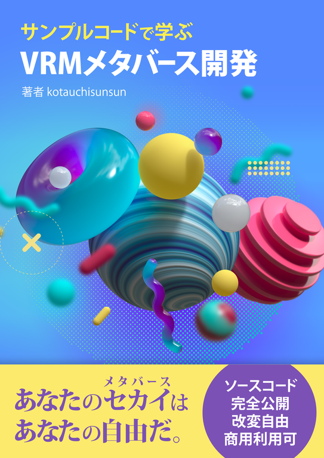

# MetaSample

これは「サンプルコードで学ぶ VRM メタバース開発」のサンプルリポジトリです。  
書籍は、技術書展 Web サイトで発売中です。

[https://techbookfest.org/product/4515940253302784](https://bit.ly/3qCrqzp)

# 動作確認済み OS

Windows 11 21H2 OS ビルド 22000.376

# 動作確認済み Unity バージョン

Unity 　 2020.3.10f1

# 使用しているアセット

- UniVRM 0.90.0(Copyright (c) 2020 VRM Consortium,Copyright (c) 2018 Masataka SUMI for MToon
  MIT License https://github.com/vrm-c/UniVRM/blob/master/LICENSE.txt)
- ユニティちゃん 3D モデルデータ ver.1.2.1(© UTJ/UCL ユニティちゃんライセンス条項 2.01 バージョン https://unity-chan.com/contents/license_jp/)
- Mirror 54.1.0(Copyright (c) 2015, Unity Technologies,Copyright (c) 2019, vis2k, Paul and Contributors MIT License https://github.com/vis2k/Mirror/blob/master/LICENSE)
- UnityStandaloneFileBrowser 1.2(Copyright (c) 2017 Gökhan Gökçe
  MIT License https://github.com/gkngkc/UnityStandaloneFileBrowser/blob/master/LICENSE.txt)

# 使用しているソフトウェア

- distributed-tcp-relay(Copyright (c) kotauchisunsun
  MIT License https://github.com/gkngkc/UnityStandaloneFileBrowser/blob/master/LICENSE.txt)

# ライセンス

MIT License

このプロジェクトをベースにソフトウェアを作る場合、アセットのライセンスや同梱するソフトウェアのライセンスも順守する必要があります。
